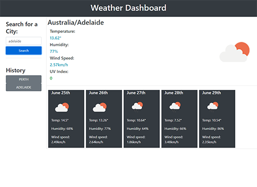

  # Weather Forecaster
  
  ## Table of Contents
  * [Description](#description)
  * [Technologies](#technologies)
  * [Installation](#installation)
  * [Usage](#usage)
  * [Contributing](#contributing)
  * [Guidelines](#guidelines)
  * [Tests](#tests)
  * [License](#license)
  * [Questions](#questions)
---

  ## Description
Designed using OpenWeather's API, this app intends to give a comprehensive breakdown of current and upcoming weather conditions from all across the world. User can look up a location using the search bar on the left hand side of the app, where previous searches will also be stored for future reference. Upon searching, the user is presented with the current days forecast, including wind speed, temperature, humidity and UV index, along with the next 5 days predicted conditions.
 

  ## Technologies
   * HTML
   * CSS
   * Bootstrap
   * JavaScript
   * JQuery
   
  ## Installation
   No installation required, visit the URL to use.

  ## Usage
   Application can be used [here](https://mleftwich.github.io/WeatherForecast/).

  ## Contributing
   If you'd like to contribute, reach out through the email listed below.

  ## Guidelines
  Can be used to plan a trip or activities for the week.

  ## Tests
   Tests conducted in development.

  ## License
   Licensed under [MIT](https://opensource.org/licenses/MIT) 

   ---

  ## Questions
   For any questions you can find me at [GitHub](https://github.com/mleftwich) or email me at [mleftwich@live.com](mailto:mleftwich@live.com) 

